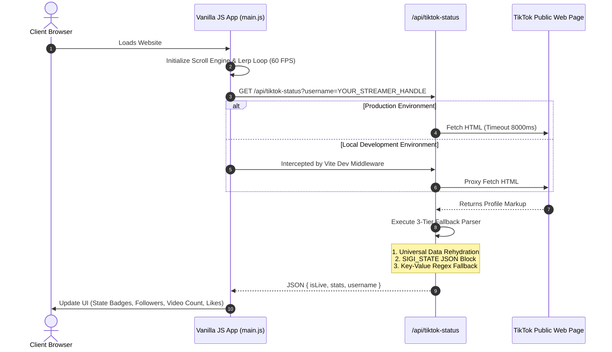

# StreamWorks — Scroll-Driven Gaming & Live Streaming Portfolio (Client Case Study)

[](https://vitejs.dev/)
[](https://tailwindcss.com/)
[](https://developer.mozilla.org/en-US/docs/Web/JavaScript)
[](https://vercel.com/)
[](LICENSE)

StreamWorks is a high-performance, scroll-driven web portfolio and live streaming platform engineered for content creators and live streamers. Developed as a client project, it combines a **60 FPS HTML5 video frame-scrubbing engine**, real-time TikTok live status detection via serverless scraping, dynamic stats aggregation, and donation platform integration.

> **Client Confidentiality Note**: All specific client branding, handles, and proprietary media assets in this repository have been anonymized or replaced with configurable environment placeholders for public portfolio demonstration.

---

### Visual Highlights

#### 1. Hero & Real-Time Live Status Tracker
*Displays live broadcast state (`LIVE NOW` vs `OFFLINE`), scraped follower/video/heart counts, and custom creator badges.*

```markdown
![Hero & Live Now Status Banner]
```


```markdown
![Hero & Offline Status Banner]
```


---

#### 2. 650vh Scroll Video Scrubbing Engine (Creator Story Arc)
*Smooth 60 FPS frame-seeking linked to scroll depth with dynamic camera transformations and text overlays.*

```markdown
![Scroll Scrubbing Demo]
```


---

#### 3. Interactive Creator Support Modal
*Donation launcher overlay to direct payment platform integration.*

```markdown
![Donation Modal Preview]
```


---

## Features

- **650vh Scroll-Scrubbing Canvas Engine**: Video timeline scrubbed dynamically across a 650vh container via linear interpolation (`lerp`).
- **Real-Time TikTok Scraper**: Edge-compatible Vercel Serverless Function that polls TikTok profile markup for live room states and stats.
- **Interactive Particle System**: 2D Canvas ambient light engine with high-DPI scaling and mobile performance degradation handling.
- **Theme Persistence**: Light and Dark mode engine with `localStorage` state retention.
- **Vite Dev Server Proxy Middleware**: Mirror serverless endpoint locally during development without spinning up external backend instances.
- **Donation Overlay Integration**: One-click donation popup supporting preset tier amounts and custom link redirection.

---

## System Architecture



---

## Technical Highlights & Engineering Decisions

### 1. 60 FPS Scroll-Driven Video Scrubbing (`src/main.js`)
To avoid main-thread jank and scroll stuttering across variable refresh rate monitors, frame updates are calculated using a decoupled render loop with **Linear Interpolation (`lerp`)**:

```javascript
// Calculate target scroll ratio [0.0 - 1.0] relative to 650vh container
const rect = heroScroller.getBoundingClientRect();
const totalScrollable = heroScroller.offsetHeight - window.innerHeight;
targetProgress = Math.min(1, Math.max(0, -rect.top / totalScrollable));

// Render loop with smoothing factor (0.075 lerp)
function renderLoop(now) {
  requestAnimationFrame(renderLoop);
  if (!isSectionVisible) return; // IntersectionObserver optimization

  smoothProgress += (targetProgress - smoothProgress) * 0.075;
  
  if (heroVideo && videoDuration > 0) {
    const targetTime = smoothProgress * videoDuration;
    if (Math.abs(heroVideo.currentTime - targetTime) > 0.03) {
      heroVideo.currentTime = targetTime;
    }
  }
}
```
- **Performance Guards**: `IntersectionObserver` pauses the render loop when the scroll container leaves the viewport to save GPU/CPU cycles.
- **Passive Listeners**: Scroll listeners run with `{ passive: true }` to ensure touch and wheel scrolling are never blocked.

---

### 2. Resilient Serverless Web Scraping Cascade (`api/tiktok-status.js`)
To monitor stream status without requiring expensive paid APIs or static key registration, the endpoint uses a **3-Tier Fallback Parser**:

```javascript
function parseTikTokData(html, profileUrl, liveUrl) {
  // Tier 1: __UNIVERSAL_DATA_FOR_REHYDRATION__ JSON Script Tag
  // Tier 2: SIGI_STATE Rehydration Script Tag
  // Tier 3: Key-Value Regex Extraction
}
```
- **Edge Cache Headers**: Returns `Cache-Control: s-maxage=60, stale-while-revalidate=30` to avoid rate limits while maintaining fresh data.
- **Fail-Safe Fallbacks**: Gracefully degrades to `{ isLive: false, stats: null }` if external services time out or return unexpected responses.

---

### 3. Adaptive 2D Particle Canvas
- Renders 64 ambient glowing particles on desktop with dynamic shadow blur.
- Automatically scales canvas buffer using `window.devicePixelRatio` for high-DPI displays.
- Reduces active particle count to 24 on mobile devices (`width < 768px`) and disables shadow blurs to guarantee consistent 60 FPS performance.

---

## API Reference

### GET `/api/tiktok-status`

Fetches real-time status and profile statistics for a specified stream handle.

#### Query Parameters

| Parameter | Type | Required | Default | Description |
|---|---|---|---|---|
| `username` | `string` | No | `env.TIKTOK_USERNAME` | Target TikTok handle without `@` |

#### Response Example (`200 OK`)

```json
{
  "isLive": true,
  "profileUrl": "https://www.tiktok.com/@streamer_username",
  "liveUrl": "https://www.tiktok.com/@streamer_username/live",
  "username": "streamer_username",
  "stats": {
    "followerCount": 125000,
    "videoCount": 430,
    "heartCount": 1800000,
    "followingCount": 120
  },
  "_debug": "Scraped profile metadata successfully"
}
```

---

## Tech Stack

| Domain | Technology | Usage |
|---|---|---|
| **Build System** | [Vite 8.x](https://vitejs.dev/) | Dev server, asset bundling, dev API middleware proxy |
| **Frontend Logic** | Vanilla JavaScript (ES6+) | Custom scroll engine, Canvas engine, state management |
| **Styling** | Tailwind CSS + Custom CSS | Responsive layout utilities, keyframe animations, dark mode |
| **Backend / API** | Node.js (Vercel Serverless) | Serverless HTML scraping & data rehydration parsing |
| **Iconography** | [Iconify](https://iconify.design/) | SVG icons (`solar:*`, `simple-icons:*`) |

---

## License

@ 2026 Irvandmw. All rights reserved. Client project showcased for portfolio purposes only
